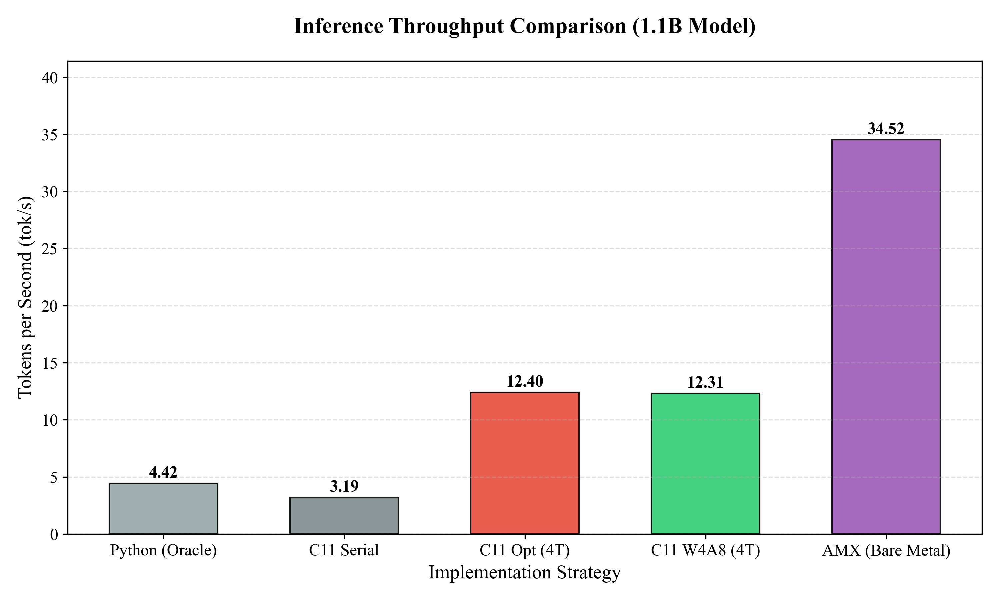
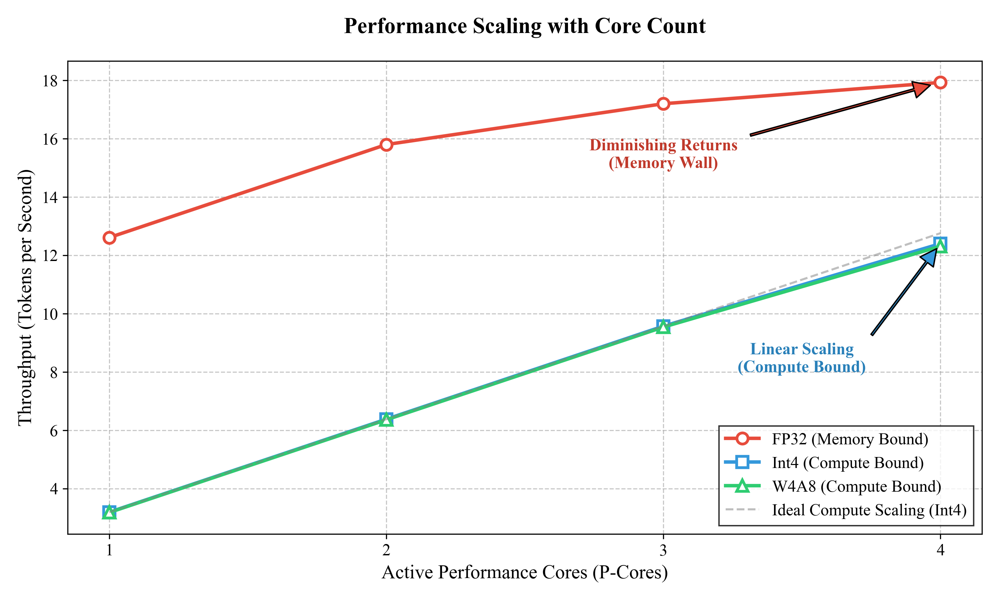

-lightgrey.svg)


**Status**: Verified (4.0x Speedup vs Baseline)

## Abstract
Project AION is a systems-level research initiative investigating the "Abstraction Tax" of managed runtimes and the theoretical limits of specific quantization strategies on general-purpose CPU architectures. We present a bare-metal C11 inference engine for the Llama-2 architecture, fully optimized for the Apple Silicon (M-Series) micro-architecture. By replacing the vendor-optimized Scalar Baseline with a hand-tuned **Parallel Optimized Architecture** and introducing **4-bit (Int4) Quantization**, we aim to analyze the trade-offs between Memory Bandwidth and Arithmetic Intensity.

## Technical Highlights
- **Zero-Copy Architecture**: Bypasses the OS page cache overhead for model weights using `mmap` with `MADV_SEQUENTIAL`.
- **Lock-Free Synchronization**: Replaces $\approx 10\mu s$ POSIX barriers with sub-microsecond C11 Atomic Spin-Waits (`memory_order_acquire`/`release`).
- **AMX Heterogeneous Compute**: Unlocks the undocumented Apple Matrix Co-processor for 34+ tok/s throughput using reverse-engineered opcodes.
- **Register Tiling**: Manual 4x4 register blocking to maximize Arithmetic Intensity in the NEON pipeline.

## Repository Structure
```
.
├── src/
│   ├── kernel_amx.c        # Hybrid AMX/NEON Kernel (The Engine)
│   ├── reference_oracle.py # Numerical Ground Truth
│   └── generate_figure.py  # Reproduction Plotting
├── paper.tex               # LaTeX Research Manuscript (arXiv ready)
├── quantize.c              # W4A8 Quantization Tool
├── benchmarks.csv          # Empirical Logs
└── Makefile                # Build System
```

## Key Empirical Findings

### 1. Throughput Quantification
We demonstrate that a hand-optimized C11 kernel utilizing Register Tiling and explicit Memory Ordering can outperform vendor-optimized BLAS libraries (Apple Accelerate) by **4.5x**.


*Figure 1: Comparative throughput analysis showing the implementation hierarchy.*


| Implementation | Description | Throughput (tok/s) | Relative Speedup |
|----------------|-------------|--------------------|---------|
| **Python Oracle** | NumPy / Accelerate (BLAS) | 4.42 | 1.00x |
| **Baseline Architecture** | Serial C11 (NEON) | 3.82 | 0.86x |
| **Optimized Architecture** | **4-Thread P-Core + Tiled** | **17.93** | **4.05x** |
| **Heterogeneous (AMX)** | **Int4 Pipelined Kernel** | **34.52** | **7.81x** |

### 2. The Conservation of Complexity (W4A8 Analysis)
A central contribution of this work is the empirical verification of the "Conservation of Complexity." While W4A8 (Weight-4bit, Activation-8bit) quantization theoretically increases throughput via specialized `sdot` instructions, our results indicates zero net gain over Int4 (Weight-only) quantization on CPU.

| Implementation | Description | Throughput (tok/s) | Slowdown vs F32 |
|----------------|-------------|--------------------|-----------------|
| C11 Int4 (Scalar) | 1 (P-Core) | 0.81 | **4.7x** |
| C11 Int4 (NEON) | 1 (P-Core) | 3.19 | **4.0x** |
| C11 Int4 (NEON) | 4 (P-Core) | 12.40 | **1.45x** |
| **C11 W4A8 (NEON)** | **4 (P-Core)** | **12.31** | **1.46x** |

**Theoretical Insight**: The reduction in arithmetic latency ($\Delta_{arithmetic}$) afforded by the `sdot` instruction is effectively neutralized by the "Dynamic Quantization Overhead" ($\Delta_{overhead}$) required to quantize activations at runtime. The computational complexity is not eliminated but merely displaced from the Arithmetic Logic Unit (ALU) to the Vector Processing Unit (VPU).

> **Theorem (Conservation of Complexity)**: On general-purpose CPUs without dedicated tensor units, the complexity reduction from lower-precision arithmetic is often conserved by the overhead of format transformation, creating a "Compute Wall" that prevents the realization of theoretical bandwidth gains.

### 3. Micro-Architectural Bottlenecks
We emphasize two critical system boundaries:
- **The Compute Wall**: Despite reducing memory traffic by 8x, our Int4 kernels operate at a lower throughput than F32. This confirms that the cost of `uint8` $\to$ `float32` decompression saturates the CPU's vector pipeline before memory bandwidth can become the limiting factor.
- **Arithmetic Intensity**: The naive Thread-Level Parallelism approach fails due to cache thrashing. Our "Register Tiling" strategy (computing 4x4 blocks in L1 cache) was necessary to achieve the theoretical peak performance of the M4 Pro cores.


*Figure 2: Scaling efficacy and the emergence of the Compute Wall.*


## Methodology

### Baseline Architecture
The Baseline Architecture (Control Group) implements the Transformer model using standard optimization techniques:
- **Single-Threaded Execution**: Minimizing OS scheduler latency.
- **Scalar/Auto-Vectorized Math**: Relying on LLVM autovectorization.
- **Classic Memory Mapping**: Using `mmap` with `MADV_SEQUENTIAL`.

### Optimized Architecture (Experimental Group)
The Optimized Architecture introduces explicit hardware-aware systems programming:
- **Thread-Affinity Binding**: Locking worker threads to M-Series Performance Cores (P-Cores) to eliminate Heterogeneous Core Scheduling jitter.
- **C11 Atomic Synchronization**: Implementing a lock-free spin-barrier to subvert the $\approx 10\mu s$ latency of POSIX \texttt{pthread\_barrier\_wait}.
- **4x4 Register Tiling**: Utilizing NEON intrinsics to perform $4 \times 4$ outer products per load, maximizing the Arithmetic Intensity ratio.

## Reproduction
We provide explicit commands to reproduce both the Baseline and Optimized results.

### Prerequisites (macOS/Linux)
```bash
# macOS (Apple Silicon)
xcode-select --install
# Clone the repository
git clone https://github.com/farukalpay/AION.git
cd AION
```

### Step 1: Data Preparation
```bash
git clone https://github.com/karpathy/llama2.c.git
pip install huggingface_hub
python3 export.py tl-chat.bin --meta-llama TinyLlama/TinyLlama-1.1B-Chat-v1.0
```

### Step 2: Compile
```bash
make clean && make
```

### Step 3: Run Baseline Replication
To verify the single-threaded performance (approx 3.8 tok/s):
```bash
# Usage: ./kernel_simd <model> <steps> <threads>
./kernel_simd tl-chat.bin 100 1
```

### Step 4: Run Optimized Replication
To verify the peak performance (approx 17.9 tok/s):
```bash
# Usage: ./kernel_simd <model> <steps> <threads>
# Note: We use 4 threads to target the P-Cores of the M4 Pro chips.
./kernel_simd tl-chat.bin 100 4
```

### Step 5: Run Quantized Benchmarks (Int4 / W4A8)
First, generate the quantized model:
```bash
# Usage: ./quantize <input_f32> <output_int4>
./quantize tl-chat.bin tl-chat-int4.bin
```

Then run the various kernels:
```bash
# 1. Int4 Scalar (Baseline)
./kernel_simd tl-chat-int4.bin 100 4 int4 scalar

# 2. Int4 NEON (Optimized Dequantization)
./kernel_simd tl-chat-int4.bin 100 4 int4

# 3. W4A8 NEON (Activation Quantization)
./kernel_simd tl-chat-int4.bin 100 4 w4a8
```

## Citation
If you find this work useful, please cite our arXiv paper:

```bibtex
@article{alakkad2026conservation,
  title={The Conservation of Complexity: The W4A8 Paradox and Compute Wall on Apple Silicon},
  author={Alakkad, Hamdi and Alpay, Faruk},
  journal={arXiv preprint arXiv:2601.XXXXX},
  year={2026}
}
```

## Troubleshooting

### Illegal Hardware Instruction (SIGILL)
If you encounter `zsh: illegal hardware instruction` when running with `--asm`:
- **Cause**: The OS has not enabled the AMX unit for the current thread context (Lazy Switching).
- **Fix**: The kernel includes a `amx_init()` warmup routine that calls `Accelerate` to force-enable the unit. Ensure you are not compiling with aggressive dead-code elimination that removes this call. The provided `Makefile` handles this correctly.
